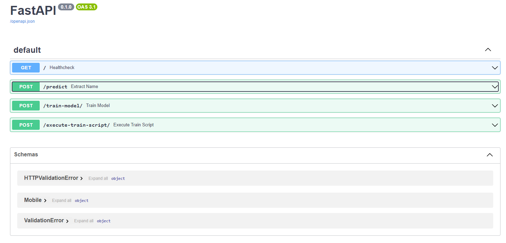
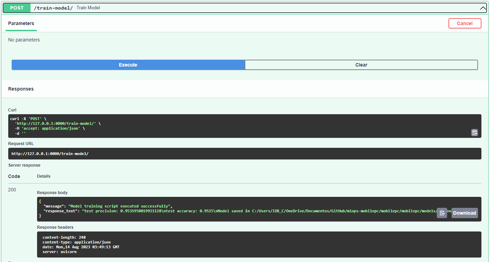

# mlops-mobilepc

Irad's repository for Mobile Price Clasiffication proyect.

## Problem context:

Bob, has taken the step of establishing his own mobile phone company. In his pursuit to challenge industry giants like Apple and Samsung, he recognizes the importance of accurately estimating the prices of his mobile phones. Aware of the fierce competition in the mobile phone market, Bob understands that informed decisions are crucial.

To address this challenge, we leverage the power of machine learning by analyzing sales data from various mobile phone companies.

Bob's goal is to unveil meaningful relationships between a mobile phone's attributes—such as RAM, internal memory, and more—and its corresponding selling price.

Because of that, this model will predict the price range of mobile phones, providing Bob with valuable insights into how different characteristics of a phone influence its potential price.

Contained within this repository is a foundational model that serves as a starting point for addressing this challenge.

The primary purpose of this model is to showcase all the necessary components that will eventually facilitate its deployment as an API—allowing it to be put into production and leveraged to enhance Bob's decision-making process.

### Dataset

You can find the data needed for this proyecto in [Kaggle public repository](https://www.kaggle.com/datasets/iabhishekofficial/mobile-price-classification).


## Overall analysis and results

If you want to see with detail what kind of analysis and results we get in order to build a solutions around a SVM model, you can check out [this proyect notebook](mobilepc/docs/mobile-price-prediction-0-983.ipynb), where you cand find all the stages of a Machine Learning model selection.


## Setup

### For Linux users:

* Change the directory to the `module-3/session-11/itesm_mlops/itesm_mlops` folder.
* Create a virtual environment with Python 3+:
  ```bash
  python310 -m venv venv
  ```
* Activate the virtual environment
  ```bash
  source venv/bin/activate
  ```
* Install the other libraries
  Run the following command to install the libraries/packages.
  ```bash
  pip install -r ./mlops-mobilepc/mobilepc/requirements_dev.txt
  ```

### For Windows users:

* Change the directory to the `/mlops-mobilepc` folder.
* Create a virtual environment with Python 3+:

  ```bash
  py -3.10 -m venv venv
  ```
* Activate the virtual environment using PowerShell

  ```bash
  venv\Scripts\Activate.ps1
  ```
* Install the other libraries
  Run the following command to install the libraries/packages.

  ```bash
  pip install -r ./mlops-mobilepc/mobilepc/requirements_dev.txt
  ```

  > **NOTE**
  > Deactivate the virtual environment using this command at the end of its example.
  > Linux: ``bash deactivate`` Windows: `deactivate`
  >

## Pytest (Unit test)

You can reproduce the unit test through the [test module](mobilepc/tests), following the next steps:

### Virtual environment

Activate the virtual environment with `Python 3.10`

For Linux:

```
venv\Scripts\Activate.ps1
```

For Windows:

```
venv\Scripts\Activate.ps1
```

> **NOTE**
> Deactivate the virtual environment using this command at the end of its example.
> Linux: ``bash deactivate`` Windows: `deactivate`

### Running the tests

The following test validates the [load_data.py](mobilepc/tests/test_mobilepc.py) module:

Follow the next steps to run the test.

* Change the directory and run the following command:
  ```bash
  cd /mobilepc
  ```
* Then run:
  ```bash
  pytest ./tests/test_mobilepc.py -v
  ```
* You should see the following data output:
  ```

  ====================================================================================================== test session starts ======================================================================================================
  platform win32 -- Python 3.10.9, pytest-7.4.0, pluggy-0.13.1 -- C:\Users\IOR_C\OneDrive\Documentos\GitHub\mlops-mobilepc\venv\Scripts\python.exe
  cachedir: .pytest_cache
  rootdir: C:\Users\IOR_C\OneDrive\Documentos\GitHub\mlops-mobilepc\mobilepc
  plugins: anyio-3.7.1
  collected 4 items

  tests/test_mobilepc.py::test_outlierfix_transform PASSED                                                                                                                                                                   [ 25%] 
  tests/test_mobilepc.py::test_custom_value_fixed_transform PASSED                                                                                                                                                           [ 50%] 
  tests/test_mobilepc.py::test_csv_file_existence PASSED                                                                                                                                                                     [ 75%] 
  tests/test_mobilepc.py::test_pkl_file_existence PASSED                                                                                                                                                                     [100%] 

  ======================================================================================================= 4 passed in 0.96s ======================================================================================================= 
  ```

## Run FastAPI

Run the next command to start the Mobile Price API locally:

> Remember to change up you directory to `mlops-mobilepc/mobilepc/mobilepc`

```bash
uvicorn api.main:app --reload
```

### Checking endpoints

1. Access `http://127.0.0.1:8000/`, you will see a message like this `"Mobile classifier is all ready to go!"`
2. Access `http://127.0.0.1:8000/docs`, the browser will display something like this:



### Running predictions

Try running the following predictions with the endpoint by writing the following values:

* **Prediction 1**Request body

  ```bash
  {
  "battery_power": 976.0,
   "blue": 0.0,
   "clock_speed": 2.0,
   "dual_sim": 0.0,
   "fc": 0.0,
   "four_g": 1.0,
   "int_memory": 5.0,
   "m_dep": 0.9,
   "mobile_wt": 184.0,
   "n_cores": 7.0,
   "pc": 14.0,
   "px_height": 496.0,
   "px_width": 797.0,
   "ram": 3261.0,
   "sc_h": 8.0,
   "sc_w": 2.0,
   "talk_time": 6.0,
   "three_g": 1.0,
   "touch_screen": 1.0,
   "wifi": 1.0,
   "price_range": 2.0
  }
  ```

  Response body
  The output will be:

  ```bash
  "Predicted Price Range: [2]"
  ```
* **Prediction 2**
  Request body

  ```bash
  {
  "battery_power": 559.0,
   "blue": 1.0,
   "clock_speed": 0.5,
   "dual_sim": 1.0,
   "fc": 0.0,
   "four_g": 1.0,
   "int_memory": 24.0,
   "m_dep": 0.8,
   "mobile_wt": 103.0,
   "n_cores": 4.0,
   "pc": 5.0,
   "px_height": 537.0,
   "px_width": 627.0,
   "ram": 2023.0,
   "sc_h": 14.0,
   "sc_w": 1.0,
   "talk_time": 2.0,
   "three_g": 1.0,
   "touch_screen": 0.0,
   "wifi": 0.0,
   "price_range": 1.0
  }
  ```

  Response body
  The output will be:

  ```
  "Predicted Price Range: [1]"
  ```

### Training model

You can also ask the API to train a model trouhg the `/train-model` endpoint, just clicking to execute:



If everything is ok, it will reponse back with a `message` and a `reponse_text` as you can see in the picture above, in the `reponse body`.

## Pre-commits

In attempt to assure quality across all modules, this proyect has a pass throug phase using Pre-commits.

Pre-commits are automated checks that run on your code before you commit changes, helping ensure code quality and consistency.

### Prerequisites

1. Python is installed on your system.
2. Visual Studio Code (VSC) is installed on your system.
3. `pip` is installed on your system.

### Step 1: Install `pre-commit`

First, you need to install the `pre-commit` tool on your system. Open your terminal or command prompt and run the following command:

```bash
pip install pre-commit
```

### Step 2: Create a Pre-Commit Configuration File

Create a file named `.pre-commit-config.yaml` in the root of your Python project. This file will define the pre-commit hooks to be executed.

### Step 3: Configure Pre-Commit Hooks

In the  [pre-commit file](.pre-commit-config.yaml), we have defined the pre-commit hooks you want to run. Each hook represents a specific check on the code. There are many pre-configured hooks available, and you can also create custom hooks if needed.

### Step 4: Initialize Pre-Commit for Your Project

After looking the `.pre-commit-config.yaml` file, initialize pre-commit for this project. Open your terminal or command prompt, navigate to the root directory of this project, and run the following command:

```bash
pre-commit install
```

Output

```bash
pre-commit installed at .git/hooks/pre-commit
```

> **NOTE**
> If you want to see the default hidden folder `.git`, follow the steps in this link: https://linuxpip.org/vscode-show-hidden-files/

### Step 5: Commit Your Changes

With the pre-commit hooks installed, you can now make changes to the Python code. When you're ready to commit changes, run the following command to trigger the pre-commit checks:

```bash
git commit -m "add pre-commit file"
```

Output

<details open>
    <summary>Pre-commit output, click to collapse</summary>

    ``bash     [WARNING] The 'rev' field of repo 'https://github.com/pre-commit/mirrors-autopep8' appears to be a mutable reference (moving tag / branch).  Mutable references are never updated after first install and are not supported.  See https://pre-commit.com/#using-the-latest-version-for-a-repository for more details.  Hint: `pre-commit autoupdate` often fixes this.     [INFO] Initializing environment for https://github.com/pre-commit/mirrors-autopep8.     [INFO] Initializing environment for https://github.com/PyCQA/flake8.     [INFO] Installing environment for https://github.com/pre-commit/mirrors-autopep8.     [INFO] Once installed this environment will be reused.     [INFO] This may take a few minutes...     [INFO] Installing environment for https://github.com/PyCQA/flake8.     [INFO] Once installed this environment will be reused.     [INFO] This may take a few minutes...     autopep8.............................................(no files to check)Skipped     flake8...............................................(no files to check)Skipped     [main 210cf52] add pre-commit file     3 files changed, 77 insertions(+)     create mode 100644 .pre-commit-config.yaml     create mode 100644 module-2/session-5/README.md     ``
    `</details>`

Pre-commit will run all the defined hooks on the files you've staged for the commit. If any issues are found (e.g., trailing whitespace, linting errors, etc.), the commit will be halted, and you'll need to address the problems before you can successfully commit.
